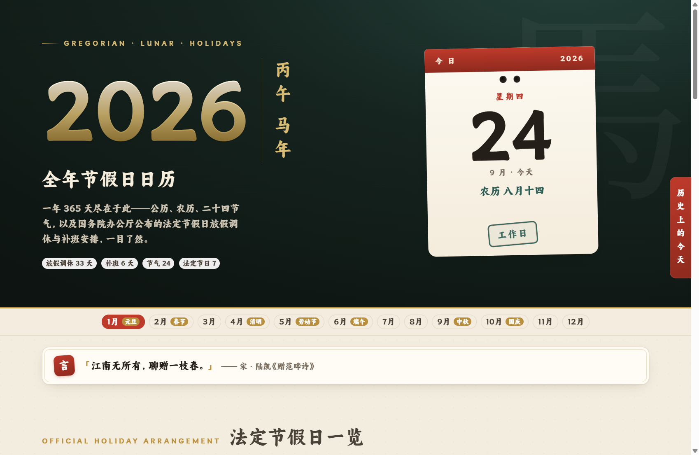
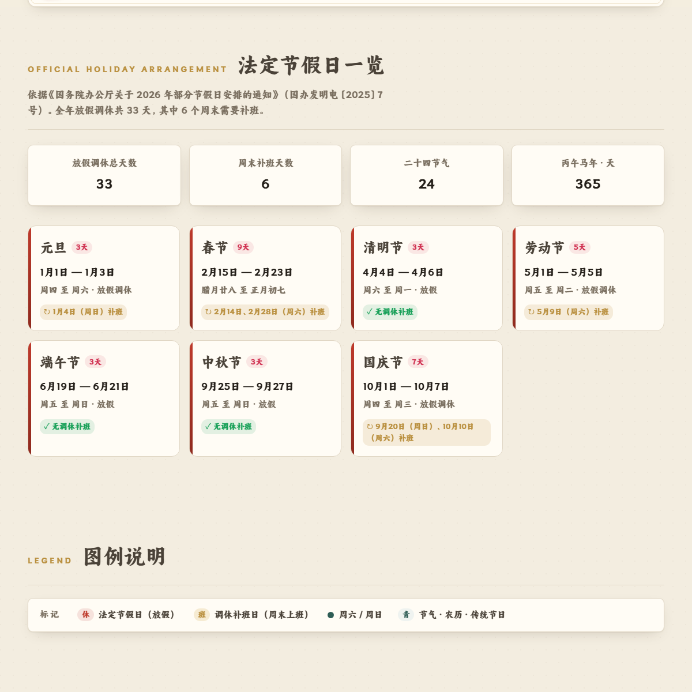
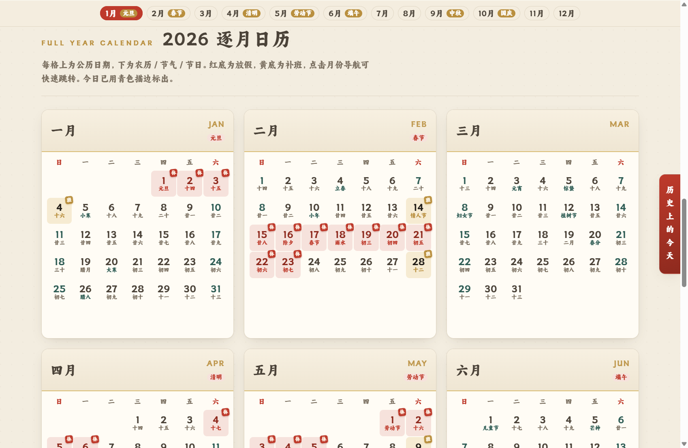

<div align="center">

# 2026 丙午马年 · 全年节假日日历

**公历 · 农历 · 二十四节气 · 法定节假日调休，一页尽览**

以宣纸中国风呈现 2026 丙午马年全年 365 天：公历、农历、节气、传统节日，以及国务院办公厅公布的法定节假日放假调休安排。


**[在线访问](https://1411430556.github.io/calendar2026-vue/)** · [快速开始](#快速开始) · [参与贡献](#贡献指南)



</div>

## 目录

- [功能特性](#功能特性)
- [界面预览](#界面预览)
- [技术栈](#技术栈)
- [快速开始](#快速开始)
- [项目结构](#项目结构)
- [数据说明](#数据说明)
- [部署（GitHub Pages）](#部署github-pages)
- [自定义与扩展](#自定义与扩展)
- [贡献指南](#贡献指南)
- [许可证](#许可证)

## 功能特性

### 日历核心

- **全年日历网格** — 12 个月逐月展示，每格含公历日期、农历 / 节气 / 节日；红底放假、黄底补班、青底节气，今日青色描边标出。
- **法定节假日一览** — 7 大节日的放假区间、天数及调休补班说明，数据依据国办发明电〔2025〕7 号。
- **今日撕历卡** — 仿台历撕页设计，动态展示当日星期、日期、农历、节日及放假 / 补班 / 工作日印章；非数据年份访问时回落展示春节样例页。
- **置顶吸顶头** — 月份导航与「每日一言」合并为一个毛玻璃吸顶头，滚动时始终可见；月份按钮随滚动位置自动高亮（scrollspy），点击平滑跳转。

### 体验增强

- **每日一言** — 接入随机诗词接口，每次刷新换一句诗词锦句，失败时静默回退内置文案。
- **历史上的今天** — 右侧竖排签直达，浮窗展示历史事件列表，对称开合动画。
- **鼠标粒子特效** — 零依赖原生 Canvas：移动散落、点击爆裂、一圈粒子环绕光标，仅响应鼠标。
- **PWA 离线可用** — Service Worker 缓存同源静态资源（含字体），二次访问离线秒开；`manifest.json` 支持安装到桌面。
- **回到顶部** — 滚动超过 200px 淡入显示，点击平滑回顶。
- **响应式适配** — 桌面 / 平板 / 手机三档断点，移动端月历单列、统计卡双列。
- **尊重系统偏好** — 动画自动适配 `prefers-reduced-motion`，刘海屏适配安全区。

### 工程特性

- **年份动态推导** — 年份、干支、生肖、中文数字年均从数据首条派生，更换数据文件即可适配其它年份，无需改代码。
- **全站字号体系** — `html` 基准 18px + 全 rem 字号，改一个值即可整体等比缩放。
- **中国风主题令牌** — CSS 变量与 naive-ui `themeOverrides` 双侧对齐（宣纸底、墨色、中国红、描金）。

## 界面预览

| 法定节假日一览 | 逐月日历 |
| --- | --- |
|  |  |

## 技术栈

| 类别 | 选型 |
| --- | --- |
| 框架 | Vue 3.5（`<script setup>` + Composition API） |
| 语言 | TypeScript（strict 模式） |
| 构建 | Vite 7 + `@vitejs/plugin-vue` |
| UI 组件库 | naive-ui（按需具名引入，业务 JS 产物约 274KB / gzip 约 87KB） |
| 字体 | 阿里妈妈东方大楷（woff2 自托管，约 2.6MB，免费商用） |
| PWA | 原生 Service Worker + Web App Manifest |
| 类型检查 | `vue-tsc` |
| 包管理 | pnpm |

> 无路由、无状态库；naive-ui 仅按需引入实际用到的组件，未全量注册。鼠标粒子特效为零依赖手写 Canvas（[`src/utils/cursorEffect.ts`](src/utils/cursorEffect.ts)）。

## 快速开始

环境要求：Node.js `>= 20`，包管理器 [pnpm](https://pnpm.io/)。

```bash
# 克隆仓库
git clone https://github.com/1411430556/calendar2026-vue.git
cd calendar2026-vue

# 安装依赖
pnpm install

# 启动开发服务器（http://localhost:5173）
pnpm dev

# 生产构建（含 vue-tsc 类型检查）
pnpm build

# 预览构建产物
pnpm preview
```

### 环境变量（可选）

「每日一言」与「历史上的今天」使用 [shwgij API](https://api.shwgij.com/)，密钥通过环境变量注入：

```bash
# 项目根目录创建 .env.local（不入库）
VITE_HISTORY_API_KEY=你的密钥
```

未配置时页面正常运行，相关接口失败会展示内置兜底文案 / 空状态。

## 项目结构

```
calendar2026-vue/
├── index.html                  # 入口 HTML（SEO meta + PWA 引用）
├── vite.config.ts              # Vite 配置（Pages 子路径 base + code-inspector）
├── tsconfig.json               # TS 配置（strict + noUnusedLocals）
├── LICENSE                     # MIT 许可证
├── .github/
│   └── workflows/
│       └── deploy.yml          # GitHub Pages 自动部署工作流
├── docs/
│   └── screenshots/            # README 展示截图
├── public/
│   ├── manifest.json           # PWA 清单
│   ├── sw.js                   # Service Worker（静态资源缓存）
│   └── *.png / favicon.svg     # 应用图标
└── src/
    ├── main.ts                 # 应用入口（注册 Service Worker）
    ├── App.vue                 # 页面骨架 + 滚动联动
    ├── theme.ts                # naive-ui 主题覆盖（themeOverrides）
    ├── styles.css              # 全部样式（CSS 变量主题 + 字号体系）
    ├── vite-env.d.ts           # Vite 客户端类型引用
    ├── components/
    │   ├── DailyQuote.vue      # 每日一言（诗词接口 + 兜底文案）
    │   ├── HistoryToday.vue    # 历史上的今天（浮窗）
    │   └── HotNews.vue         # 百度热搜新闻榜（浮窗）
    ├── composables/
    │   ├── useSidePanel.ts     # 浮窗公共开合机制（互斥避让 / 外部点击关闭 / 滚轮锁定 / 下拉手势）
    │   ├── useHotNews.ts       # 热搜数据状态机（缓存 / 限速 / 重试 / 预取 / 定时刷新）
    │   └── useHotNews.test.ts  # 服务端时间戳清洗单元测试
    ├── utils/
    │   ├── api.ts              # 公共请求层（密钥注入 / 超时 / 解包 / 限速器）
    │   ├── api.test.ts         # 请求层单元测试
    │   ├── beijing.ts          # 北京时间（UTC+8）换算
    │   ├── beijing.test.ts     # 北京时间换算单元测试
    │   ├── cursorEffect.ts     # 鼠标粒子特效（零依赖 Canvas）
    │   ├── format.ts           # 展示格式化（补零 / 热搜数 / 涨跌标记 / 年份）
    │   ├── format.test.ts      # 格式化单元测试
    │   ├── storage.ts          # localStorage 读写封装（脏 JSON 容错）
    │   └── storage.test.ts     # 存储封装单元测试
    ├── assets/
    │   └── fonts/              # 阿里妈妈东方大楷 woff2 + 授权文件
    └── data/
        └── calendar2026.ts     # 全量日历数据（唯一数据源）
```

## 数据说明

所有日历数据集中在 [`src/data/calendar2026.ts`](src/data/calendar2026.ts)，为预生成的硬编码数组，包含 365 条 `DayInfo` 记录与 7 条 `HolidayMeta` 节假日元数据。

### DayInfo 字段

| 字段 | 类型 | 说明 |
| --- | --- | --- |
| `date` | string | ISO 日期，如 `2026-01-01` |
| `m` / `d` | number | 公历月 / 日 |
| `wd` | number | 星期，**0=周一 … 6=周日**（Python `weekday` 约定，非 JS 约定） |
| `lunar` | string | 农历短文本（初一显示月份名，其余显示日名） |
| `full` | string | 完整农历（如 `八月初十`），撕历卡专用 |
| `fest` | string \| null | 节气 / 节日，显示优先级高于 `lunar` |
| `hol` | string \| null | 法定假日名（非空即放假） |
| `ban` | boolean | 是否调休补班日 |

> 注意：`wd` 为周一制（0=周一），新增或修改数据时请勿按 JS `getDay()`（周日=0）填写，否则整月错位。

### 数据来源

- 法定节假日：国务院办公厅《关于 2026 年部分节假日安排的通知》（国办发明电〔2025〕7 号）
- 农历：`lunardate` 推算并经锚点校验
- 节气：太阳黄经天文计算（东八区定日）

## 部署（GitHub Pages）

推送 `main` 分支后，[`.github/workflows/deploy.yml`](.github/workflows/deploy.yml) 自动完成 pnpm 安装 → 类型检查与构建 → 部署到 GitHub Pages，线上地址：<https://1411430556.github.io/calendar2026-vue/>

要点：

- **首次启用**：仓库 `Settings` → `Pages` → `Source` 选择 **GitHub Actions**，之后每次推送自动部署，也可在 Actions 页手动触发（`workflow_dispatch`）。
- **接口密钥**：在仓库 `Settings` → `Secrets and variables` → `Actions` 中配置 `VITE_HISTORY_API_KEY`，工作流构建时会注入产物。
- **子路径 base**：项目页部署在 `/calendar2026-vue/` 下，`vite.config.ts` 通过 `process.env.GITHUB_ACTIONS` 判断 CI 环境并启用子路径 `base`，本地开发仍为根路径。

## 自定义与扩展

### 更换为其它年份

1. 替换 `src/data/calendar2026.ts`（可重命名为对应年份，同时更新 `App.vue` 中的 import 路径）。
2. 确保新数据的 `date` 字段首条为目标年份 1 月 1 日。
3. 页面年份、干支、生肖、今日高亮会自动跟随，无需修改 `App.vue`。

### 调整节假日数据

直接编辑 `calendar2026.ts` 中对应日期的 `hol` / `ban` 字段，以及 `HOLIDAYS` 数组的卡片元数据。

### 修改配色

编辑 [`src/styles.css`](src/styles.css) 顶部 `:root` 中的 CSS 变量即可全局换色；注意 `App.vue` 的 `themeOverrides` 需同步同色值。

### 调整全站字号

修改 `src/styles.css` 中 `html` 的 `font-size`（当前 `112.5%` ≈ 18px）即可整体等比缩放，各层级比例不变。

## 贡献指南

欢迎提交 Issue 与 Pull Request！

1. Fork 本仓库并创建特性分支：`git checkout -b feat/your-feature`
2. 提交改动，提交信息使用中文并遵循约定式格式：

   ```text
   <type>(<scope>): <描述>
   ```

   - **type**：`feat` / `fix` / `docs` / `style` / `refactor` / `perf` / `test` / `chore` / `ci`
   - **scope**：影响范围，如 `components`、`styles`、`data`、`utils`
   - 示例：`feat(components): 历史上的今天浮窗支持键盘操作`

3. 提交前请确保 `pnpm build`（含类型检查）通过。
4. 推送分支并发起 Pull Request，描述清楚改动动机与验证方式。

## 许可证

本项目代码基于 [MIT License](LICENSE) 开源。

第三方资源说明：

- **阿里妈妈东方大楷**：版权归淘宝（中国）软件有限公司所有，依据官方声明免费授权个人与企业商用，授权条款见 [`src/assets/fonts/LICENSE.txt`](src/assets/fonts/LICENSE.txt)；不得单独出售、出租该字体文件。

> 节假日安排数据仅供参考，最终以国务院办公厅正式通知为准。
